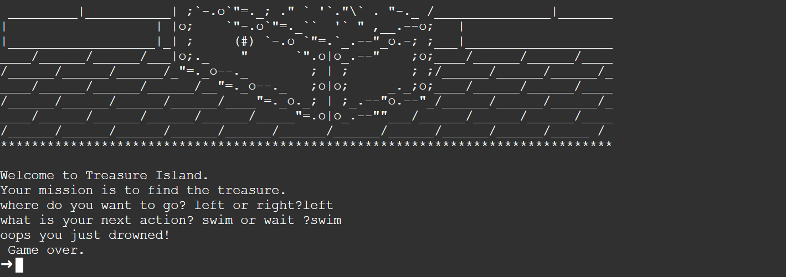

`print("Welcome to Treasure Island.")`
`print("Your mission is to find the treasure.") `

### https://www.draw.io/?lightbox=1&highlight=0000ff&edit=_blank&layers=1&nav=1&title=Treasure%20Island%20Conditional.drawio#Uhttps%3A%2F%2Fdrive.google.com%2Fuc%3Fid%3D1oDe4ehjWZipYRsVfeAx2HyB7LCQ8_Fvi%26export%3Ddownload

    direction=input("where do you want to go? left or right?").lower()

    if direction == "left":
    decision=input("what is your next action? swim or wait ?").lower()
        if decision == "wait":
        door= input("what door color would you pick? blue ,yellow ,red?").lower()
            if door != "blue":
            print("You lose!\n Game over.")
            else:
            print("welldone you have found the treasure!\n You win.")
        else:
          print ("oops you just drowned!\n Game over.")
    else:
    print("You have fallen into a hole .\n Game over.")
    